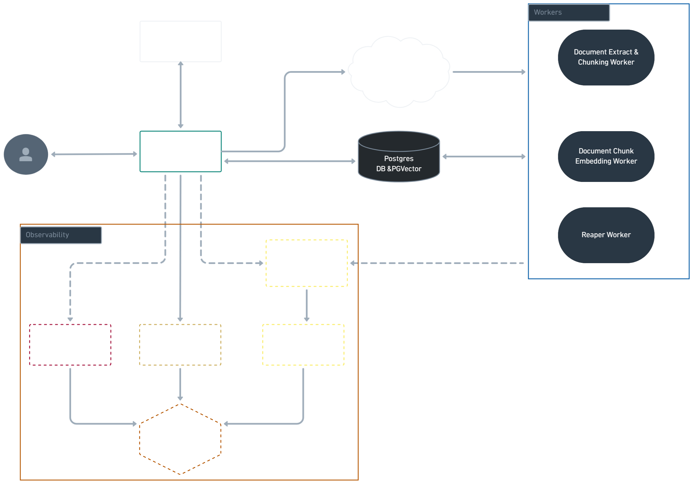
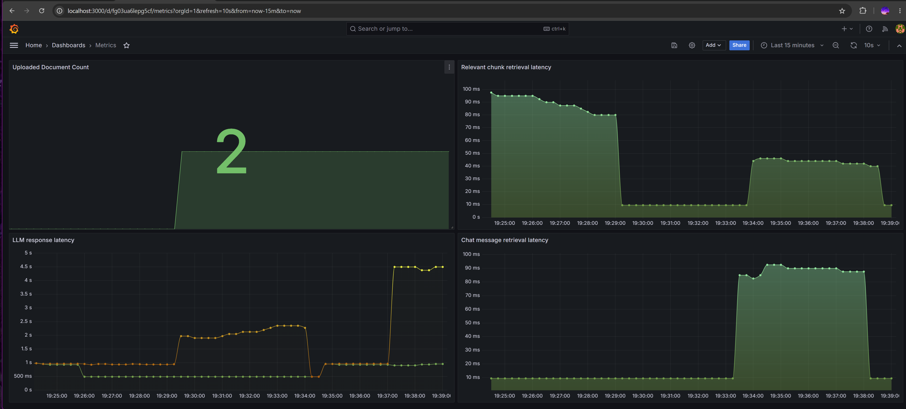
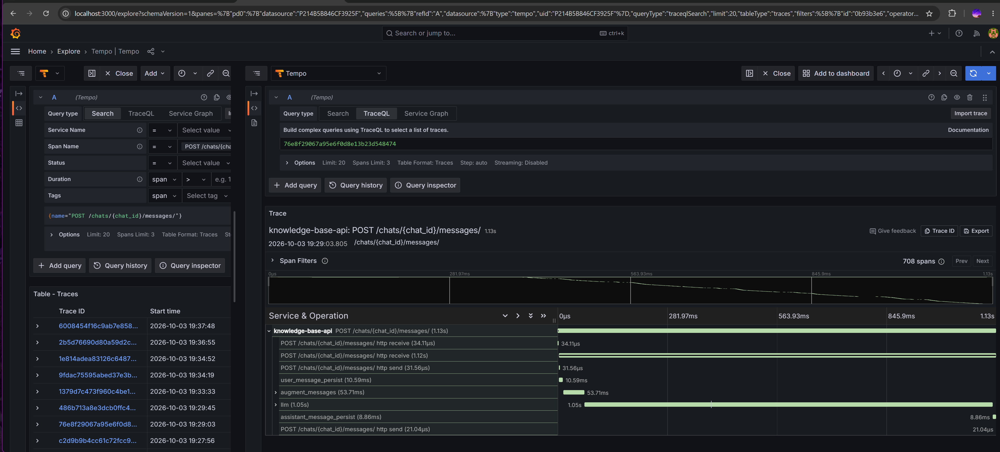

This a document based RAG application also known as Knowledge Base (KB).

KB allows users to upload documents of various formats and enquire informations from the uploaded documents.

# System Architecture Overview

## Observability:

### Dashboards

### Traces

This project uses docker compose to spin up required services.
On root directory, with docker engine running, execute
`docker compose up -d`

To bring down services
`docker compose down`
